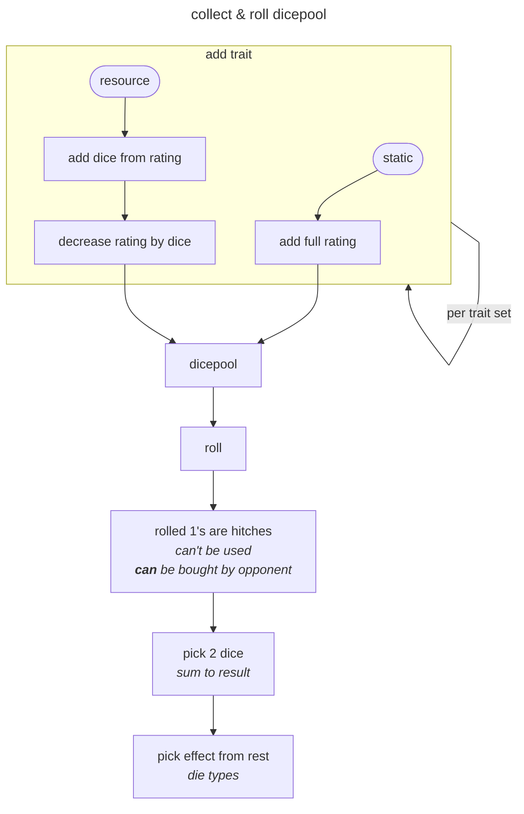
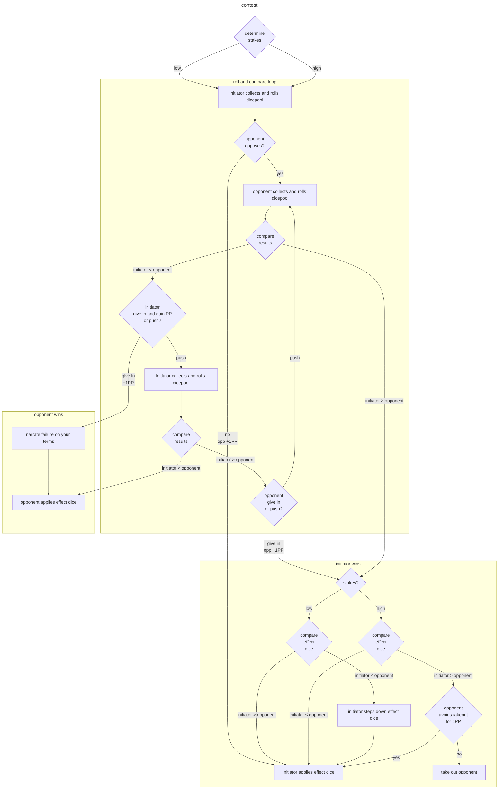

```mermaid
---
title: collect & roll dicepool
---
flowchart
	subgraph add_t[add trait]
		direction TB
		static([static])-->add_s_f[add full rating]
		resource([resource])-->add_r[add dice from rating]-->dec_r[decrease rating by dice]
	end
	add_t-->|per trait set|add_t
	dicepool
	add_s_f-->dicepool
	dec_r-->dicepool
	dicepool-->roll
	roll-->hitch["`rolled 1's are hitches
		*can't be used
		**can** be bought by opponent*`"]
	hitch-->pick_r["`pick 2 dice
		*sum to result*`"]
	pick_r-->pick_e["`pick effect from rest
		*die types*`"]
```

```mermaid
---
title: contest
---
flowchart TB

	high_stakes{determine
		stakes}
		
	subgraph rc_loop[roll and compare loop]
		init[initiator collects and rolls dicepool]
		opp{opponent
			opposes?}
		init-->opp
		opp_y[opponent collects and rolls dicepool]
		opp-->|yes|opp_y
		give_push{initiator
			give in and gain PP
			or push?}
		comp_r{compare
			results}
		init2[initiator collects and rolls dicepool]
		init2-->comp_r2{compare
			results}
		opp_give_push{opponent
			give in
			or push?}
		opp_y-->comp_r
		comp_r-->|initiator #lt; opponent|give_push
		give_push-->|push|init2
		comp_r2-->|initiator #ge; opponent|opp_give_push
		opp_give_push-->|push|opp_y
	end
	
	high_stakes-->|low|init
	high_stakes-->|high|init
	opp-->|no
		opp +1PP|init_a_e
	opp_give_push-->|give in
		opp +1PP|stakes
	comp_r-->|initiator #ge; opponent|stakes
	comp_r2-->|initiator #lt; opponent|opp_a_e
	give_push-->|give in
		+1PP|init_fail
	
	subgraph init_w[initiator wins]
		stakes{stakes?}
		ls_comp_e{compare
			effect
			dice}
		hs_comp_e{compare
			effect
			dice}
		stakes-->|low|ls_comp_e
		stakes-->|high|hs_comp_e
		avoid_to{opponent
				avoids takeout
				for 1PP}
		opp_to[take out opponent]
		step_d[initiator steps down effect dice]
		init_a_e[initiator applies effect dice]
		ls_comp_e-->|initiator #gt; opponent|init_a_e
		ls_comp_e-->|initiator #le; opponent|step_d
		hs_comp_e-->|initiator #le; opponent|init_a_e
		hs_comp_e-->|initiator #gt; opponent|avoid_to
		step_d-->init_a_e
		avoid_to-->|yes|init_a_e
		avoid_to-->|no|opp_to
	end
	
	subgraph opp_w[opponent wins]
		init_fail[narrate failure on your terms]
		opp_a_e[opponent applies effect dice]
		init_fail-->opp_a_e
	end
```
